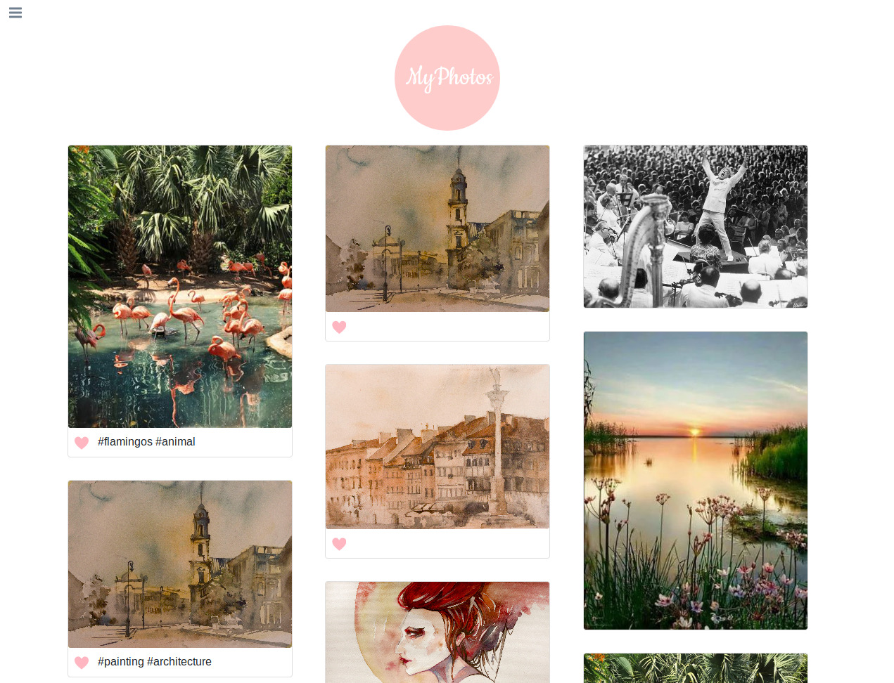
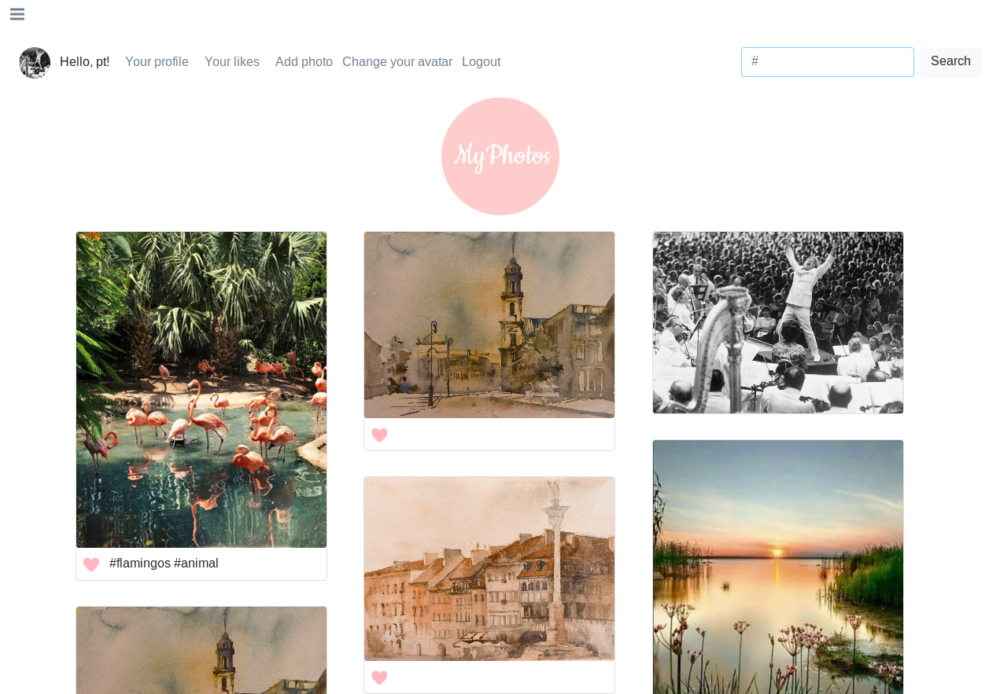
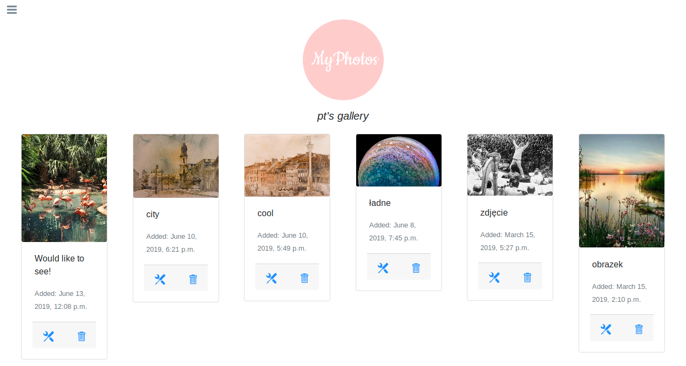

# LunchTime

### Info
Photo gallery created in Django. The app was inspired by Instagram.


 
 
 


### Technologies
* Python 3.6 
* Django 2.1 
* PostgreSQL
* Bootstrap 4
* jQuery

### Functions
Registered user can:
* view photos
* add photos
* like photos
* comment photos
* view liked photos
* view other users' galleries
* change avatar

### Installation
* clone repository
```
git clone https://github.com/pautomaszewska/Photo-gallery
```
* create virtual environment and install requirements
```
virtualenv -p pytho3 env
source env/bin/activate
pip install -r requirements.txt
```
* rename 'settings_example.py' to 'settings.py'
* create database 'gallery' and configure it in settings.py
```
psql -U 'username'
create databese gallery;
```
* run migrations for 'gallery' app
```
python manage.py makemigrations gallery
python manage.py migrate
python manage.py runserver
```
